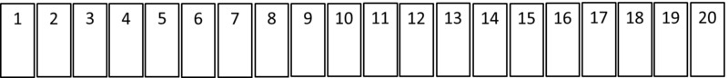

# The Locker Problem

**Category:** Number Theory 

**Date:** 08/11/2025  

**Problem description**

A school has 100 lockers numbered from 1 to 100, all initially closed. 100 students go through the hallway in turn. The rules are:

*Student 1*  visits every locker and opens it, since they are all closed.

*Student 2* visits every 2nd locker (2, 4, 6,…) and toggles it: if open → close, if closed → open.

*Student 3* visits every 3rd locker (3, 6, 9,…) and toggles each one.

*Student 4* visits every 4th locker (4, 8, 12,…) and toggles each one.

…

This continues until Student 100, who visits locker number 100, completes their turn.

**Question:** After the 100th student finishes, which lockers remain open, and which are closed?

## Proof

First, we need to see that lockers are only touched by students who are factors of that locker number. For example, locker #10 is only touched by students 1, 2, 5 and 10.

This means the 10th locker was opened by the 1st student, then it was closed by the 2nd student, then it was opened by the 5th student, and then closed one last time by the 10th student.

Now note that the *square numbers* are the only numbers with an *odd number of factors* (all other numbers have factors which come in pairs.) 

Since an odd number of factors means the locker will be changed an odd number of times, it must be **open** at the end.

Apply to 1 … 100. The squares ≤ 100 are {1, 4, 9, 16, 25, 36, 49, 64, 81, 100}

**Thus exactly 10 lockers remain open, all the rest are closed.**
